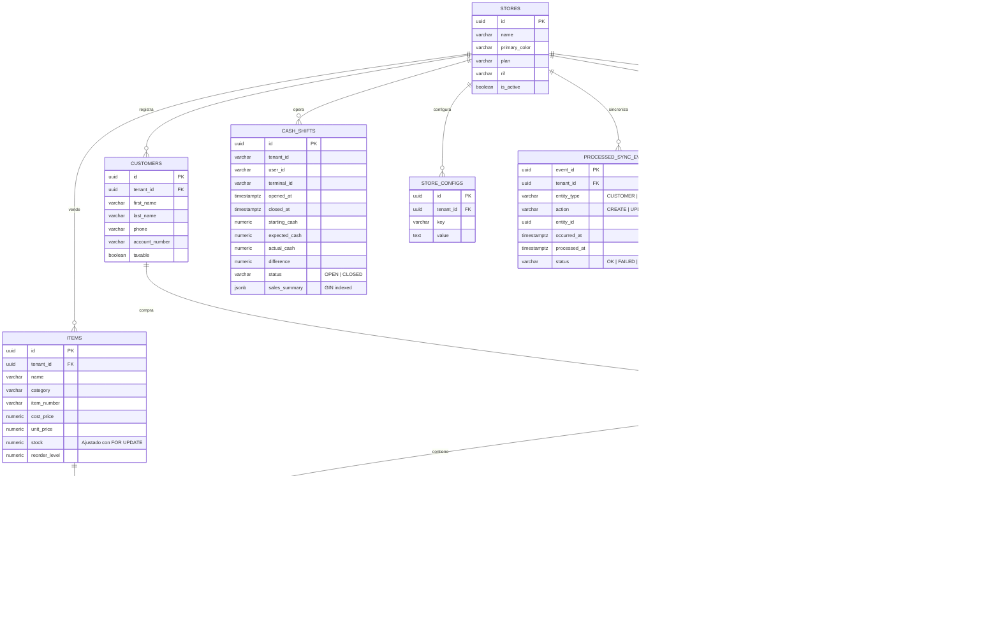

# 📦 Paquete Técnico para DBA — Merx POS SaaS
### Migración SQLite → PostgreSQL 16

**Proyecto:** Merx POS — Sistema de Punto de Venta Offline-First Multi-Tenant  
**Fecha:** 2026-04-02  
**Preparado por:** Equipo de Ingeniería  
**Destinatario:** DBA Externo para Validación  

---

## Entregable 1: DDL Completo (PostgreSQL)

```sql
-- ═══════════════════════════════════════════════════════════════════════════════
--  Merx POS — DDL PostgreSQL 16
--  Arquitectura: Multi-Tenant con tenant_id en cada tabla (Row-Level Isolation)
--  PKs: UUIDv4 generados en el cliente (Offline-First)
-- ═══════════════════════════════════════════════════════════════════════════════

BEGIN;

-- ─── Extensiones requeridas ────────────────────────────────────────────────────
CREATE EXTENSION IF NOT EXISTS "uuid-ossp";
CREATE EXTENSION IF NOT EXISTS "pgcrypto";

-- ═══════════════════════════════════════════════════════════════════════════════
--  1. STORES (Tenants)
-- ═══════════════════════════════════════════════════════════════════════════════
CREATE TABLE stores (
    id            UUID PRIMARY KEY,
    name          VARCHAR(255) NOT NULL,
    primary_color VARCHAR(20) DEFAULT '#3B82F6',
    logo_url      VARCHAR(255),
    is_active     BOOLEAN DEFAULT TRUE,
    plan          VARCHAR(30) DEFAULT 'FREE',
    rif           VARCHAR(30),
    owner_email   VARCHAR(255),
    created_at    TIMESTAMPTZ DEFAULT NOW(),
    updated_at    TIMESTAMPTZ DEFAULT NOW()
);

COMMENT ON TABLE stores IS 'Tabla raíz Multi-Tenant. Cada store es un cliente/comercio independiente.';

-- ═══════════════════════════════════════════════════════════════════════════════
--  2. USERS
-- ═══════════════════════════════════════════════════════════════════════════════
CREATE TABLE users (
    id                BIGSERIAL PRIMARY KEY,
    tenant_id         UUID NOT NULL REFERENCES stores(id) ON DELETE CASCADE,
    username          VARCHAR(255) NOT NULL UNIQUE,
    password          VARCHAR(255) NOT NULL,
    first_name        VARCHAR(255) NOT NULL,
    last_name         VARCHAR(255) NOT NULL,
    email             VARCHAR(255),
    phone             VARCHAR(30),
    address           TEXT,
    role              VARCHAR(20) DEFAULT 'CASHIER'
                      CHECK (role IN ('SUPER_ADMIN', 'ADMIN', 'MANAGER', 'CASHIER')),
    telegram_chat_id  VARCHAR(255),
    remember_token    VARCHAR(100),
    created_at        TIMESTAMPTZ DEFAULT NOW(),
    updated_at        TIMESTAMPTZ DEFAULT NOW(),
    deleted_at        TIMESTAMPTZ
);

CREATE INDEX idx_users_tenant ON users (tenant_id);
CREATE INDEX idx_users_deleted ON users (tenant_id, deleted_at);

COMMENT ON TABLE users IS 'Usuarios del sistema. PK auto-incremental (requerido por Sanctum). Soft-delete. Roles: SUPER_ADMIN (SaaS root), ADMIN (dueño de tienda), MANAGER (encargado), CASHIER (cajero, default).';

-- ═══════════════════════════════════════════════════════════════════════════════
--  3. PASSWORD RESET TOKENS
-- ═══════════════════════════════════════════════════════════════════════════════
CREATE TABLE password_reset_tokens (
    email      VARCHAR(255) PRIMARY KEY,
    token      VARCHAR(255) NOT NULL,
    created_at TIMESTAMPTZ
);

-- ═══════════════════════════════════════════════════════════════════════════════
--  4. SESSIONS
-- ═══════════════════════════════════════════════════════════════════════════════
CREATE TABLE sessions (
    id            VARCHAR(255) PRIMARY KEY,
    user_id       BIGINT REFERENCES users(id) ON DELETE SET NULL,
    ip_address    VARCHAR(45),
    user_agent    TEXT,
    payload       TEXT NOT NULL,
    last_activity INTEGER NOT NULL
);

CREATE INDEX idx_sessions_user ON sessions (user_id);
CREATE INDEX idx_sessions_activity ON sessions (last_activity);

-- ═══════════════════════════════════════════════════════════════════════════════
--  5. CUSTOMERS
-- ═══════════════════════════════════════════════════════════════════════════════
CREATE TABLE customers (
    id              UUID PRIMARY KEY,
    tenant_id       UUID NOT NULL REFERENCES stores(id) ON DELETE CASCADE,
    first_name      VARCHAR(255) NOT NULL,
    last_name       VARCHAR(255) NOT NULL,
    company_name    VARCHAR(255),
    account_number  VARCHAR(50),
    taxable         BOOLEAN DEFAULT TRUE,
    email           VARCHAR(255),
    phone           VARCHAR(30),
    address         TEXT,
    created_at      TIMESTAMPTZ DEFAULT NOW(),
    updated_at      TIMESTAMPTZ DEFAULT NOW(),
    deleted_at      TIMESTAMPTZ
);

CREATE INDEX idx_customers_tenant ON customers (tenant_id);
CREATE UNIQUE INDEX idx_customers_account ON customers (tenant_id, account_number)
    WHERE account_number IS NOT NULL;
CREATE INDEX idx_customers_deleted ON customers (tenant_id, deleted_at);

COMMENT ON TABLE customers IS 'Clientes por tenant. UUID generado en el dispositivo offline del cajero.';

-- ═══════════════════════════════════════════════════════════════════════════════
--  6. ITEMS (Inventario)
-- ═══════════════════════════════════════════════════════════════════════════════
CREATE TABLE items (
    id                    UUID PRIMARY KEY,
    tenant_id             UUID NOT NULL REFERENCES stores(id) ON DELETE CASCADE,
    name                  VARCHAR(255) NOT NULL,
    category              VARCHAR(100) NOT NULL,
    item_number           VARCHAR(100),
    description           TEXT,
    cost_price            NUMERIC(15,2) NOT NULL,
    unit_price            NUMERIC(15,2) NOT NULL,
    stock                 NUMERIC(15,2) DEFAULT 0,
    reorder_level         NUMERIC(15,2) DEFAULT 0,
    receiving_quantity    INTEGER DEFAULT 1,
    allow_alt_description BOOLEAN DEFAULT FALSE,
    is_serialized         BOOLEAN DEFAULT FALSE,
    created_at            TIMESTAMPTZ DEFAULT NOW(),
    updated_at            TIMESTAMPTZ DEFAULT NOW(),
    deleted_at            TIMESTAMPTZ
);

CREATE INDEX idx_items_tenant ON items (tenant_id);
CREATE UNIQUE INDEX idx_items_number ON items (tenant_id, item_number)
    WHERE item_number IS NOT NULL;
CREATE INDEX idx_items_category ON items (tenant_id, category);
CREATE INDEX idx_items_deleted ON items (tenant_id, deleted_at);
CREATE INDEX idx_items_low_stock ON items (tenant_id, stock, reorder_level)
    WHERE deleted_at IS NULL;

COMMENT ON TABLE items IS 'Catálogo de productos. UUID offline. Incluye control de stock con nivel de reorden.';
COMMENT ON COLUMN items.stock IS 'Stock actual. Se ajusta vía SELECT...FOR UPDATE en SyncEventProcessor.';

-- ═══════════════════════════════════════════════════════════════════════════════
--  7. SALES (Cabecera de Ventas)
-- ═══════════════════════════════════════════════════════════════════════════════
CREATE TABLE sales (
    id              UUID PRIMARY KEY,
    tenant_id       UUID NOT NULL REFERENCES stores(id) ON DELETE CASCADE,
    invoice_number  VARCHAR(50),
    comment         TEXT,
    sale_time       TIMESTAMPTZ DEFAULT NOW(),
    terminal_id     VARCHAR(30) DEFAULT 'CAJA_01',
    customer_id     UUID REFERENCES customers(id) ON DELETE SET NULL,
    employee_id     BIGINT NOT NULL REFERENCES users(id),
    payment_method  VARCHAR(30) DEFAULT 'DIVISA'
                    CHECK (payment_method IN (
                        'DIVISA', 'EFECTIVO_BS', 'PAGO_MOVIL', 'PUNTO', 'FIADO', 'MIXTO'
                    )),
    status          VARCHAR(20) DEFAULT 'PAGADO'
                    CHECK (status IN ('PAGADO', 'PENDIENTE', 'ANULADO')),
    subtotal        NUMERIC(15,2) DEFAULT 0,
    tax_percent     NUMERIC(5,2) DEFAULT 16,
    tax_amount      NUMERIC(15,2) DEFAULT 0,
    total           NUMERIC(15,2) DEFAULT 0,
    paid_amount     NUMERIC(15,2) DEFAULT 0,
    amount_received NUMERIC(15,2) DEFAULT 0,
    change_amount   NUMERIC(15,2) DEFAULT 0,
    reference       VARCHAR(255),
    due_date        TIMESTAMPTZ,
    created_at      TIMESTAMPTZ DEFAULT NOW(),
    updated_at      TIMESTAMPTZ DEFAULT NOW(),
    deleted_at      TIMESTAMPTZ
);

CREATE INDEX idx_sales_tenant ON sales (tenant_id);
CREATE INDEX idx_sales_time ON sales (tenant_id, sale_time DESC);
CREATE INDEX idx_sales_status ON sales (tenant_id, status);
CREATE INDEX idx_sales_employee ON sales (tenant_id, employee_id, sale_time DESC);
CREATE UNIQUE INDEX idx_sales_invoice ON sales (tenant_id, invoice_number)
    WHERE invoice_number IS NOT NULL;
CREATE INDEX idx_sales_fiados ON sales (tenant_id, customer_id, status)
    WHERE status = 'PENDIENTE';

COMMENT ON TABLE sales IS 'Ventas. UUID generado offline. FK employee_id es BIGINT (users.id auto-inc).';

-- ═══════════════════════════════════════════════════════════════════════════════
--  8. SALE_ITEMS (Detalle / Líneas de Venta)
-- ═══════════════════════════════════════════════════════════════════════════════
CREATE TABLE sale_items (
    id                  UUID PRIMARY KEY,
    tenant_id           UUID NOT NULL REFERENCES stores(id) ON DELETE CASCADE,
    sale_id             UUID NOT NULL REFERENCES sales(id) ON DELETE CASCADE,
    item_id             UUID NOT NULL REFERENCES items(id),
    line                INTEGER DEFAULT 0,
    description         VARCHAR(255),
    serial_number       VARCHAR(100),
    quantity_purchased  NUMERIC(15,2) DEFAULT 0,
    item_cost_price     NUMERIC(15,2) NOT NULL,
    item_unit_price     NUMERIC(15,2) NOT NULL,
    discount_percent    NUMERIC(5,2) DEFAULT 0,
    created_at          TIMESTAMPTZ DEFAULT NOW(),
    updated_at          TIMESTAMPTZ DEFAULT NOW(),
    deleted_at          TIMESTAMPTZ
);

CREATE INDEX idx_sale_items_tenant ON sale_items (tenant_id);
CREATE INDEX idx_sale_items_sale ON sale_items (sale_id);
CREATE UNIQUE INDEX idx_sale_items_line ON sale_items (sale_id, item_id, line);

-- ═══════════════════════════════════════════════════════════════════════════════
--  9. SALE_PAYMENTS (Abonos a Ventas Fiadas)
-- ═══════════════════════════════════════════════════════════════════════════════
CREATE TABLE sale_payments (
    id              UUID PRIMARY KEY,
    tenant_id       UUID NOT NULL REFERENCES stores(id) ON DELETE CASCADE,
    sale_id         UUID NOT NULL REFERENCES sales(id) ON DELETE CASCADE,
    amount          NUMERIC(15,2) NOT NULL,
    payment_method  VARCHAR(30) DEFAULT 'EFECTIVO',
    reference       VARCHAR(255),
    note            TEXT,
    paid_at         TIMESTAMPTZ DEFAULT NOW(),
    created_at      TIMESTAMPTZ DEFAULT NOW(),
    updated_at      TIMESTAMPTZ DEFAULT NOW(),
    deleted_at      TIMESTAMPTZ
);

CREATE INDEX idx_sale_payments_tenant ON sale_payments (tenant_id);
CREATE INDEX idx_sale_payments_sale ON sale_payments (tenant_id, sale_id);

-- ═══════════════════════════════════════════════════════════════════════════════
-- 10. PROCESSED_SYNC_EVENTS (Idempotencia del Outbox Pattern)
-- ═══════════════════════════════════════════════════════════════════════════════
CREATE TABLE processed_sync_events (
    event_id      UUID PRIMARY KEY,
    tenant_id     UUID NOT NULL REFERENCES stores(id) ON DELETE CASCADE,
    entity_type   VARCHAR(30) NOT NULL,
    action        VARCHAR(30) NOT NULL,
    entity_id     UUID NOT NULL,
    occurred_at   TIMESTAMPTZ NOT NULL,
    processed_at  TIMESTAMPTZ DEFAULT NOW(),
    status        VARCHAR(20) DEFAULT 'OK'
                  CHECK (status IN ('OK', 'FAILED', 'SKIPPED')),
    error_message TEXT
);

CREATE INDEX idx_sync_tenant ON processed_sync_events (tenant_id);
CREATE INDEX idx_sync_entity ON processed_sync_events (tenant_id, entity_type, entity_id);
CREATE INDEX idx_sync_processed ON processed_sync_events (tenant_id, processed_at DESC);

COMMENT ON TABLE processed_sync_events IS
    'Registro de idempotencia. Cada event_id del frontend se marca aquí para evitar reprocesamiento.';

-- ═══════════════════════════════════════════════════════════════════════════════
-- 11. STORE_CONFIGS (Configuración por Tenant)
-- ═══════════════════════════════════════════════════════════════════════════════
CREATE TABLE store_configs (
    id          UUID PRIMARY KEY,
    tenant_id   UUID NOT NULL REFERENCES stores(id) ON DELETE CASCADE,
    key         VARCHAR(100) NOT NULL,
    value       TEXT NOT NULL,
    created_at  TIMESTAMPTZ DEFAULT NOW(),
    updated_at  TIMESTAMPTZ DEFAULT NOW(),
    deleted_at  TIMESTAMPTZ
);

CREATE UNIQUE INDEX idx_store_configs_key ON store_configs (tenant_id, key);

-- ═══════════════════════════════════════════════════════════════════════════════
-- 12. CASH_SHIFTS (Turnos de Caja)
-- ═══════════════════════════════════════════════════════════════════════════════
CREATE TABLE cash_shifts (
    id              UUID PRIMARY KEY,
    tenant_id       VARCHAR(100) NOT NULL,
    user_id         VARCHAR(100) NOT NULL,
    terminal_id     VARCHAR(50) DEFAULT 'CAJA_01',
    opened_at       TIMESTAMPTZ NOT NULL,
    closed_at       TIMESTAMPTZ,
    starting_cash   NUMERIC(12,2) DEFAULT 0,
    expected_cash   NUMERIC(12,2) DEFAULT 0,
    actual_cash     NUMERIC(12,2),
    difference      NUMERIC(12,2),
    status          VARCHAR(10) DEFAULT 'OPEN'
                    CHECK (status IN ('OPEN', 'CLOSED')),
    sales_summary   JSONB,
    created_at      TIMESTAMPTZ DEFAULT NOW(),
    updated_at      TIMESTAMPTZ DEFAULT NOW(),
    deleted_at      TIMESTAMPTZ
);

CREATE INDEX idx_shifts_tenant ON cash_shifts (tenant_id);
CREATE INDEX idx_shifts_user ON cash_shifts (user_id);
CREATE UNIQUE INDEX idx_shifts_open ON cash_shifts (tenant_id, user_id, status)
    WHERE status = 'OPEN';

-- Índice GIN para búsquedas dentro del JSON de resumen de ventas
CREATE INDEX idx_shifts_summary_gin ON cash_shifts USING GIN (sales_summary);

COMMENT ON TABLE cash_shifts IS
    'Turnos de caja. El cierre usa SELECT...FOR UPDATE para atomicidad.';
COMMENT ON COLUMN cash_shifts.sales_summary IS
    'JSONB con desglose por método de pago. Ej: {"DIVISA": 150.00, "PAGO_MOVIL": 80.50}';

-- ═══════════════════════════════════════════════════════════════════════════════
-- 13. PERSONAL_ACCESS_TOKENS (Laravel Sanctum)
-- ═══════════════════════════════════════════════════════════════════════════════
CREATE TABLE personal_access_tokens (
    id             BIGSERIAL PRIMARY KEY,
    tokenable_type VARCHAR(255) NOT NULL,
    tokenable_id   BIGINT NOT NULL,
    name           VARCHAR(255) NOT NULL,
    token          VARCHAR(64) NOT NULL UNIQUE,
    abilities      TEXT,
    last_used_at   TIMESTAMPTZ,
    expires_at     TIMESTAMPTZ,
    created_at     TIMESTAMPTZ DEFAULT NOW(),
    updated_at     TIMESTAMPTZ DEFAULT NOW()
);

CREATE INDEX idx_tokens_tokenable ON personal_access_tokens (tokenable_type, tokenable_id);

-- ═══════════════════════════════════════════════════════════════════════════════
-- 14. CACHE & JOBS (Framework Infrastructure)
-- ═══════════════════════════════════════════════════════════════════════════════
CREATE TABLE cache (
    key        VARCHAR(255) PRIMARY KEY,
    value      TEXT NOT NULL,
    expiration INTEGER NOT NULL
);

CREATE TABLE cache_locks (
    key        VARCHAR(255) PRIMARY KEY,
    owner      VARCHAR(255) NOT NULL,
    expiration INTEGER NOT NULL
);

CREATE TABLE jobs (
    id           BIGSERIAL PRIMARY KEY,
    queue        VARCHAR(255) NOT NULL,
    payload      TEXT NOT NULL,
    attempts     SMALLINT DEFAULT 0,
    reserved_at  INTEGER,
    available_at INTEGER NOT NULL,
    created_at   INTEGER NOT NULL
);

CREATE INDEX idx_jobs_queue ON jobs (queue, reserved_at);

CREATE TABLE failed_jobs (
    id         BIGSERIAL PRIMARY KEY,
    uuid       VARCHAR(255) NOT NULL UNIQUE,
    connection TEXT NOT NULL,
    queue      TEXT NOT NULL,
    payload    TEXT NOT NULL,
    exception  TEXT NOT NULL,
    failed_at  TIMESTAMPTZ DEFAULT NOW()
);

COMMIT;
```

---

## Entregable 2: Diagrama ERD (Mermaid.js)



---

## Entregable 3: Memorándum de Auditoría para DBA

---

### MEMORÁNDUM TÉCNICO
**Para:** DBA Externo  
**De:** Equipo de Ingeniería — Merx POS  
**Asunto:** Validación de Decisiones Arquitectónicas para Migración a PostgreSQL 16  
**Fecha:** 2 de Abril, 2026  

---

#### 1. Contexto del Sistema

Merx POS es un sistema de Punto de Venta **Offline-First** diseñado para comercios en Venezuela. La arquitectura funciona así:

1. El cajero opera **sin conexión a internet** desde un navegador web (React + Dexie/IndexedDB).
2. Todas las transacciones (ventas, ajustes de stock, abonos) se encolan localmente como **eventos inmutables** en un Outbox (patrón Event Sourcing).
3. Cuando hay conectividad, un **Drain Loop** envía los eventos al backend Laravel vía `POST /api/sync/events`.
4. El backend procesa cada evento dentro de una **transacción atómica** con idempotencia garantizada.

Este modelo justifica las siguientes decisiones que solicitamos validar.

---

#### 2. Uso de UUIDv4 como Primary Keys

> [!IMPORTANT]
> **Decisión:** Todas las tablas de negocio (`items`, `customers`, `sales`, `sale_items`, `sale_payments`, `cash_shifts`, `processed_sync_events`, `store_configs`) usan `UUID` como PK.

**Justificación:**
- Los IDs se generan **en el dispositivo del cajero** (navegador), antes de que exista conexión con el servidor. Un auto-incremental requeriría consultar al servidor para obtener el siguiente ID, lo cual es imposible offline.
- UUIDv4 garantiza unicidad global sin coordinación central, eliminando conflictos cuando múltiples terminales sincronizan simultáneamente.

**Impacto en PostgreSQL:**
- Los UUIDs de 128 bits son más grandes que `BIGINT` (64 bits), lo que incrementa el tamaño de los índices B-Tree.
- **Mitigación**: Consideramos migrar a **UUIDv7** en una fase futura. UUIDv7 es monotónico-creciente (basado en timestamp), lo que reduce la fragmentación del B-Tree y mejora el rendimiento de INSERT en ~20-30%.

**Excepción:** La tabla `users` usa `BIGSERIAL` porque Laravel Sanctum requiere un integer morphable ID para los tokens de autenticación.

**Solicitud al DBA:** Validar que el tamaño de los índices UUID no será problemático con nuestro volumen esperado (~10,000 ventas/mes por tenant, ~50 tenants en el primer año).

---

#### 3. Columnas JSONB e Índices GIN

> [!IMPORTANT]
> **Decisión:** La columna `cash_shifts.sales_summary` es de tipo `JSONB` con un índice GIN aplicado.

**Justificación:**
- Al cerrar un turno de caja, el frontend calcula y envía un resumen de ventas desglosado por método de pago. Ejemplo:
```json
{
    "DIVISA": 450.00,
    "PAGO_MOVIL": 230.50,
    "PUNTO": 180.00,
    "total_sales": 12,
    "total_revenue_usd": 860.50
}
```
- Este campo es consultado en reportes administrativos para filtrar turnos por método de pago dominante o rango de ingresos.

**Índice GIN propuesto:**
```sql
CREATE INDEX idx_shifts_summary_gin ON cash_shifts USING GIN (sales_summary);
```

**Solicitud al DBA:**
1. ¿El índice GIN es la estrategia correcta para este caso de uso, o un índice funcional sobre keys específicas (`sales_summary->>'total_revenue_usd'`) sería más eficiente?
2. ¿Debe configurarse `gin_pending_list_limit` para evitar acumulación en escrituras concurrentes?

---

#### 4. Bloqueos a Nivel de Fila (SELECT ... FOR UPDATE)

> [!WARNING]
> **Decisión:** Usamos `SELECT ... FOR UPDATE` (row-level exclusive lock) en dos flujos críticos del `SyncEventProcessor.php`.

**Flujo 1 — Ajuste de Stock (`ITEM:ADJUST_STOCK`):**
```php
$item = Item::where('id', $payload['item_id'])
    ->lockForUpdate()   // SELECT ... FOR UPDATE
    ->firstOrFail();

$newStock = $item->stock + $delta;
if ($newStock < 0) throw new InsufficientStockException(...);
$item->update(['stock' => $newStock]);
```

**Flujo 2 — Cierre de Caja (`SHIFT:CLOSE`):**
```php
$shift = CashShift::where('id', $payload['shift_id'])
    ->lockForUpdate()
    ->firstOrFail();

$shift->close(actualCash: ..., expectedCash: ..., salesSummary: ...);
```

**Flujo 3 — Abonos a Fiados (`SALE_PAYMENT:CREATE`):**
```php
$sale = Sale::where('id', $payload['sale_id'])
    ->lockForUpdate()
    ->firstOrFail();

$sale->paid_amount += $payment->amount;
if ($sale->paid_amount >= $sale->total) $sale->status = 'PAGADO';
$sale->save();
```

**Análisis de Riesgo de Deadlock:**

| Escenario | Tablas bloqueadas | Orden | Riesgo |
|-----------|-------------------|-------|--------|
| Venta con stock | `items` (1 fila por item) | Single-table, single-row | 🟢 Bajo |
| Cierre de caja | `cash_shifts` (1 fila) | Single-table, single-row | 🟢 Bajo |
| Abono a fiado | `sale_payments` INSERT + `sales` UPDATE | Two-table, consistent order | 🟡 Moderado |

**Nuestra evaluación:** El riesgo de deadlock es bajo porque:
1. Cada evento del Drain Loop se procesa **secuencialmente** dentro de un batch (no hay paralelismo intra-batch).
2. Los locks son de **corta duración** (microsegundos, no segundos).
3. Nunca se bloquean dos filas de la misma tabla en una sola transacción.

**Solicitud al DBA:**
1. ¿Recomienda configurar `deadlock_timeout` a un valor específico para nuestro caso? (Default: 1s)
2. ¿Debemos implementar un `lock_timeout` como circuit breaker? Ej: `SET LOCAL lock_timeout = '5s'`
3. ¿Validar que `SERIALIZABLE` isolation level NO es necesario? Actualmente usamos `READ COMMITTED` (default de PG).

---

#### 5. Resumen de Índices Propuestos

| Tabla | Índice | Tipo | Justificación |
|-------|--------|------|---------------|
| `items` | `(tenant_id, item_number)` | UNIQUE PARTIAL | Búsqueda por código de barras |
| `items` | `(tenant_id, category)` | B-Tree | Filtrado en catálogo POS |
| `items` | `(tenant_id, stock, reorder_level)` | PARTIAL (deleted_at IS NULL) | Alertas de stock bajo |
| `sales` | `(tenant_id, sale_time DESC)` | B-Tree | Dashboard de ventas recientes |
| `sales` | `(tenant_id, customer_id, status)` | PARTIAL (status='PENDIENTE') | Cuaderno de Fiados |
| `cash_shifts` | `(tenant_id, user_id, status)` | UNIQUE PARTIAL (status='OPEN') | Un turno abierto por usuario |
| `cash_shifts` | `sales_summary` | GIN | Consultas sobre resumen JSON |
| `processed_sync_events` | `(tenant_id, entity_type, entity_id)` | B-Tree | Lookup de idempotencia |

**Total:** 18 índices sobre 13 tablas.

**Solicitud al DBA:** ¿Algún índice es redundante o falta alguno crítico para nuestros patrones de consulta?

---

#### 6. Configuración de PostgreSQL Recomendada (VPS 4GB RAM)

```ini
# postgresql.conf — Tuning para Merx POS (4GB RAM VPS)

# Memory
shared_buffers = 1GB
effective_cache_size = 2GB
work_mem = 16MB
maintenance_work_mem = 256MB

# WAL
wal_buffers = 16MB
min_wal_size = 512MB
max_wal_size = 2GB

# Planner
random_page_cost = 1.1          # SSD
effective_io_concurrency = 200  # SSD

# Connections
max_connections = 50            # Suficiente para 10 cajeros concurrentes

# Checkpoints
checkpoint_completion_target = 0.9

# Logging
log_min_duration_statement = 500  # Log queries > 500ms
log_lock_waits = on               # Detectar locks largos
deadlock_timeout = 1s
```

**Solicitud al DBA:** Validar estos valores para nuestro hardware target (VPS Ubuntu 24.04, 4 vCPUs, 4GB RAM, SSD NVMe).

---

*Fin del Memorándum. Quedamos a disposición para cualquier consulta técnica adicional.*
