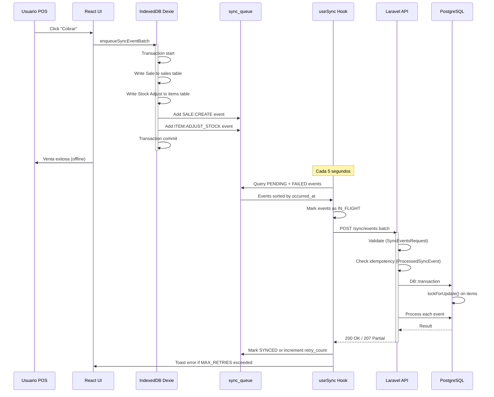

# 🏗️ Auditoría de Arquitectura — Merx POS SaaS

**Fecha:** 2026-05-26  
**Auditor:** Roo (Arquitecto)  
**Versión del código:** Monorepo pnpm con Laravel 13 + NestJS + React/Tauri

---

## Resumen Ejecutivo

| Severidad | Cantidad |
|-----------|----------|
| 🔴 Crítico | 4 |
| 🟠 Alto | 6 |
| 🟡 Medio | 8 |
| 🟢 Bajo | 5 |
| ✅ Correcto | 10 |

---

## 1. Arquitectura General

### 🔴 **CRÍTICO: Dual Backend sin justificación clara (Laravel + NestJS)**

El sistema tiene **dos backends completos** que compiten por las mismas responsabilidades:

| Capa | Laravel (`apps/api-laravel`) | NestJS (`apps/api`) |
|------|------------------------------|---------------------|
| Auth | Sanctum + tokens | JWT + Passport |
| Items CRUD | SyncEventProcessor | ItemsService + SyncController |
| Settings | SettingsController | SettingsModule |
| SaaS mgmt | SaasController | SaasModule |
| Sync | SyncController (outbox) | SyncController (RxDB pull/push) |
| Customers | SyncEventProcessor | CustomersModule |
| Inventory | InventoryController | InventoryController |

**Problemas:**
- **Duplicación de lógica de negocio**: Items, Customers, Settings se manejan en ambos backends con schemas diferentes (Prisma vs Eloquent).
- **Dos sistemas de sincronización**: Laravel procesa eventos outbox (`POST /api/sync/events`), NestJS tiene su propio sync RxDB (`GET /api/sync/pull`, `POST /api/sync/push`). El frontend actual solo usa el de Laravel, dejando el de NestJS como dead code.
- **Dos sistemas de auth**: Laravel usa Sanctum, NestJS usa JWT. El frontend usa el token de Laravel (`pos_token`) pero también hay endpoints NestJS protegidos con JWT.
- **Confusión de responsabilidades**: No está claro qué backend es el "source of truth" para cada entidad.

**Recomendación:** Definir una estrategia clara de migración. Si Laravel es el backend principal, eliminar la duplicación en NestJS o viceversa. Mantener dos backends activos simultáneamente es insostenible.

### 🟠 **ALTO: Dual sync mechanism (RxDB dead code)**

El archivo [`apps/api/src/sync.controller.ts`](apps/api/src/sync.controller.ts) implementa un protocolo de replicación RxDB (pull/push) que **no es utilizado por el frontend actual**. El frontend migró a un outbox pattern propio con Dexie.js. Esto es código muerto que:
- Aumenta la superficie de mantenimiento
- Puede causar confusión sobre cuál es el mecanismo de sync activo
- Tiene su propia lógica de resolución de conflictos (LWW) que difiere del outbox

### 🟡 **MEDIO: packages/shared infrautilizado**

[`packages/shared/src/index.ts`](packages/shared/src/index.ts) solo contiene interfaces genéricas (`SyncPayload<T>`, `ItemDTO`) que no se usan en ningún lado. El propósito del paquete compartido se ha diluido.

### ✅ **CORRECTO: Monorepo bien estructurado con pnpm workspaces**

El monorepo está bien organizado:
- `apps/api-laravel/` — Backend Laravel
- `apps/api/` — Backend NestJS
- `apps/web/` — Frontend React + Tauri
- `packages/shared/` — Código compartido
- Uso de `turbo` para orquestación de builds

---

## 2. Patrón Offline-First (Outbox Pattern)

### ✅ **CORRECTO: Diseño del outbox pattern**

El patrón outbox está **muy bien implementado**:

1. **Atomicidad**: [`enqueueSyncEvent`](apps/web/src/db/enqueueSyncEvent.ts) usa `Dexie.transaction('rw', ...)` para escribir atómicamente en la tabla local + la cola de salida.
2. **Batch support**: [`enqueueSyncEventBatch`](apps/web/src/db/enqueueSyncEvent.ts:208) permite operaciones multi-entidad en una sola transacción (ej: venta + N ajustes de stock).
3. **Idempotencia**: [`ProcessedSyncEvent`](apps/api-laravel/app/Models/ProcessedSyncEvent.php) evita procesar el mismo evento dos veces.
4. **Drain loop**: [`useSync`](apps/web/src/hooks/useSync.ts) cada 5 segundos con manejo de IN_FLIGHT, retry_count, y MAX_RETRIES=10.
5. **HTTP 207 Partial Content**: El backend responde con éxito parcial para que el frontend sepa qué eventos fallaron.

### 🟠 **ALTO: No hay resolución de conflictos real**

El outbox pattern actual es **Last-Write-Wins (LWW) implícito**. Si dos cajeros modifican el mismo producto offline simultáneamente:
- El último evento en llegar al servidor gana
- No hay detección de conflictos
- No hay merge de cambios
- El frontend no recibe notificación de que su cambio fue sobreescrito

**Riesgo:** En un escenario multi-terminal con conectividad intermitente, dos terminales pueden modificar el mismo item y una de las modificaciones se pierde silenciosamente.

### 🟡 **MEDIO: No hay cola de reintentos con backoff exponencial**

El drain loop usa intervalo fijo de 5s. Si la red falla, todos los eventos se reintentan cada 5s hasta MAX_RETRIES (10), luego se marcan como FAILED permanentemente. No hay:
- Backoff exponencial
- Jitter para evitar thundering herd
- Mecanismo de "dead letter queue" para eventos permanentemente fallidos

### 🟢 **BAJO: No hay métricas de sync**

No se trackea:
- Latencia de sincronización
- Tasa de éxito/fallo
- Tamaño de la cola
- Tiempo desde que un evento se genera hasta que se sincroniza

---

## 3. Multi-Tenancy

### ✅ **CORRECTA: Implementación del TenantScope**

El trait [`HasTenant`](apps/api-laravel/app/Models/Traits/HasTenant.php) con el global scope [`TenantScope`](apps/api-laravel/app/Models/Scopes/TenantScope.php) es una implementación **correcta y segura**:
- Se aplica automáticamente a TODAS las queries via Global Scope de Eloquent
- Es imposible olvidar el filtro de tenant
- Se puede saltar explícitamente con `withoutGlobalScope()` (necesario para login)
- Auto-asigna `tenant_id` en el evento `creating()`

### ✅ **CORRECTA: Base de datos compartida con tenant_id**

Usan una sola base de datos PostgreSQL con `tenant_id` como discriminador en todas las tablas. Esto es la estrategia correcta para un SaaS con miles de tenants pequeños (POS).

### 🟠 **ALTO: NestJS no tiene TenantScope automático**

En NestJS, el tenant isolation se hace **manualmente** en cada controller/service:
```typescript
// apps/api/src/items/items.service.ts
findAll(storeId: string) {
    return this.prisma.item.findMany({ where: { storeId } });
}
```

No hay un middleware global que inyecte el filtro de tenant. Es **fácil olvidarlo** al agregar un nuevo endpoint. En Laravel esto es imposible por el Global Scope, pero en NestJS es responsabilidad del desarrollador.

### 🟡 **MEDIO: User no usa HasTenant**

El modelo [`User`](apps/api-laravel/app/Models/User.php) explícitamente **NO usa** el trait `HasTenant`. Esto es intencional (para permitir login cross-tenant), pero significa que queries como `User::all()` devuelven usuarios de TODOS los tenants. Si un endpoint expone usuarios sin filtrar manualmente, hay riesgo de data leak.

### ✅ **CORRECTA: Login usa withoutGlobalScopes**

El [`AuthController::login`](apps/api-laravel/app/Http/Controllers/Api/AuthController.php:22) correctamente usa `User::withoutGlobalScopes()` para encontrar al usuario en cualquier tenant, y luego asocia el token al tenant del usuario.

---

## 4. Escalabilidad

### 🟠 **ALTO: Cuello de botella — SyncEventProcessor secuencial**

El [`SyncEventProcessor::processBatch`](apps/api-laravel/app/Services/Sync/SyncEventProcessor.php:106) procesa eventos **uno por uno** en un bucle `foreach`. Para un batch de 500 eventos:
- Cada evento abre una transacción DB
- Cada evento hace lockForUpdate() en filas
- El tiempo total es la suma de todos los eventos

**Impacto:** Con 1000+ tenants haciendo sync cada 5 segundos, el servidor puede saturarse.

### 🟠 **ALTO: Sin rate limiting ni throttling**

No hay protección contra:
- Un tenant que envía batches de 500 eventos cada 5 segundos
- Un tenant malicioso que inunda el sistema
- Picos de sync después de una caída de red (thundering herd)

### 🟡 **MEDIO: Sin caché de lectura**

Los endpoints de lectura (`/api/items`, `/api/customers`) siempre consultan la base de datos. No hay:
- Caché en Redis para catálogos de productos
- Caché de settings
- Estrategia de invalidación

### 🟡 **MEDIO: Queue driver = database**

[`config/queue.php`](apps/api-laravel/config/queue.php:16) usa `database` como driver por defecto. Para producción con múltiples workers, esto puede causar:
- Contención de locks en la tabla `jobs`
- Mayor latencia que Redis
- Problemas de escalabilidad horizontal

### 🟢 **BAJO: Sin connection pooling configurado explícitamente**

No hay configuración de pool de conexiones para PostgreSQL. Laravel usa una conexión por request, lo que puede agotar las conexiones disponibles con muchos workers.

---

## 5. Modularidad y Acoplamiento

### ✅ **CORRECTA: SyncEventProcessor bien desacoplado**

El [`SyncEventProcessor`](apps/api-laravel/app/Services/Sync/SyncEventProcessor.php) es un **ejemplo de buena arquitectura**:
- Responsabilidad única: procesar eventos de sync
- Handlers privados para cada entidad
- Transacciones atómicas
- Idempotencia
- Manejo de errores por tipo de excepción

### 🟡 **MEDIO: Controladores Laravel con lógica de negocio**

Varios controladores mezclan lógica de negocio con HTTP:
- [`SettingsController::scrapeBcvRate`](apps/api-laravel/app/Http/Controllers/Api/SettingsController.php:116) — scraping del BCV dentro del controlador
- [`SaasController::createStore`](apps/api-laravel/app/Http/Controllers/Api/SaasController.php:39) — lógica de creación de tenant en el controlador
- [`DashboardController::summary`](apps/api-laravel/app/Http/Controllers/Api/DashboardController.php:27) — lógica financiera en el controlador

**Ideal:** Mover esta lógica a Services/ Actions.

### 🟡 **MEDIO: BCV scraping duplicado**

La tasa BCV se scrapea en **dos lugares**:
1. [`SettingsController::scrapeBcvRate`](apps/api-laravel/app/Http/Controllers/Api/SettingsController.php:116) (Laravel)
2. [`BcvService`](apps/api/src/settings/bcv.service.ts) (NestJS)

Esto duplica lógica y potencialmente da resultados diferentes.

### ✅ **CORRECTA: Controladores delgados en NestJS**

Los controladores NestJS (`ItemsController`, `SettingsController`, `InventoryController`) están bien diseñados — delgados, delegan a servicios, y usan guards para auth.

---

## 6. Manejo de Errores

### ✅ **CORRECTO: Manejo de errores en SyncController**

El [`SyncController::processBatch`](apps/api-laravel/app/Http/Controllers/Api/SyncController.php:33) tiene un manejo de errores **ejemplar**:
- Excepciones de negocio (`InsufficientStockException`) → 207 Partial
- Eventos no soportados (`InvalidArgumentException`) → 207 con tipo
- Entidades no encontradas (`ModelNotFoundException`) → 207 con tipo
- Errores inesperados (`\Throwable`) → 207 con mensaje genérico
- Logging en cada caso

### 🟠 **ALTO: Sin circuit breakers ni retry patterns**

No hay implementación de:
- Circuit breakers para llamadas externas (BCV, Groq, email)
- Retry con backoff para fallos transitorios
- Timeouts configurables por servicio externo

### 🟡 **MEDIO: Sin validación de stock en frontend**

El frontend no valida stock antes de permitir una venta. La validación solo ocurre en el backend cuando el evento se procesa. Esto significa que:
- El usuario puede agregar al carrito un producto sin stock
- La venta fallará en el sync (con un toast de error)
- El usuario no tiene feedback inmediato

### ✅ **CORRECTO: InsufficientStockException bien diseñada**

La excepción [`InsufficientStockException`](apps/api-laravel/app/Exceptions/InsufficientStockException.php) incluye:
- El Item (para mostrar nombre)
- Cantidad solicitada
- Stock disponible
- Mensaje descriptivo

---

## 7. Configuración (12-Factor App)

### ✅ **CORRECTO: Configuración vía variables de entorno**

Todas las configuraciones usan `env()` con defaults seguros. Ejemplos:
- `DB_CONNECTION` default `sqlite` (seguro para dev)
- `LOG_CHANNEL` default `stack`
- `QUEUE_CONNECTION` default `database`

### 🟠 **ALTO: JWT_SECRET hardcodeado en NestJS**

En [`auth.module.ts`](apps/api/src/auth/auth.module.ts:13):
```typescript
secret: process.env.JWT_SECRET || 'super-secret-key-change-me',
```

Si alguien despliega sin configurar `JWT_SECRET`, la clave es pública y cualquier persona puede firmar JWTs válidos.

### 🟡 **MEDIO: CORS demasiado permisivo en NestJS**

En [`main.ts`](apps/api/src/main.ts:12):
```typescript
app.enableCors({ origin: true, credentials: true });
```

`origin: true` refleja cualquier origen. En producción debería restringirse a dominios específicos.

### ✅ **CORRECTO: CORS bien configurado en Laravel**

[`config/cors.php`](apps/api-laravel/config/cors.php:22) tiene una lista explícita de orígenes permitidos, incluyendo Tauri.

### 🟢 **BAJO: Sin health check endpoint**

Laravel tiene `/up` (configurado en `bootstrap/app.php:12`) pero NestJS no tiene health check. No hay un endpoint unificado para monitoreo.

---

## 8. Pruebas

### 🔴 **CRÍTICO: Sin tests reales**

- Laravel: Solo [`ExampleTest.php`](apps/api-laravel/tests/Feature/ExampleTest.php) y [`ExampleTest.php`](apps/api-laravel/tests/Unit/ExampleTest.php) — tests vacíos del framework.
- NestJS: **Cero tests** (no se encontraron archivos `.spec.ts`).
- Frontend: **Cero tests** (no se encontraron archivos `.test.*`).

**Esto es bloqueante para producción.** No hay:
- Tests unitarios para SyncEventProcessor (la pieza más crítica)
- Tests de integración para el outbox pattern
- Tests de validación de tenant isolation
- Tests de idempotencia
- Tests de concurrencia (stock locking)

### 🔴 **CRÍTICO: Sin CI/CD pipeline**

No hay archivos de GitHub Actions, GitLab CI, o cualquier otro pipeline de CI/CD. No hay:
- Ejecución automática de tests
- Linting automatizado
- Type checking
- Deploy automatizado

---

## 9. Observabilidad

### 🟡 **MEDIO: Logging básico sin estructura**

El logging usa `Log::info()`, `Log::error()`, `console.log()` — todo texto plano sin formato estructurado. No hay:
- **Correlation IDs** para tracking de requests a través de servicios
- **Logs en JSON** para ingestión por herramientas como ELK, Datadog, Grafana Loki
- **Niveles de log consistentes** (debug vs info vs warning vs error)

### 🔴 **CRÍTICO: Sin métricas ni tracing**

No hay:
- **Métricas de negocio**: ventas por hora, ingresos, tenants activos, etc.
- **Métricas técnicas**: latencia de API, tasa de error, uso de DB, uso de cola
- **Distributed tracing**: no se puede seguir un request a través de Laravel → DB → cola
- **APM**: no hay New Relic, Datadog APM, Sentry, etc.

### 🟡 **MEDIO: Sin alertas**

No hay configuración de alertas para:
- Eventos de sync fallidos
- Stock crítico
- Trial expirado
- Errores 5xx
- Latencia alta

---

## 10. Documentación

### 🟢 **BAJO: Documentación mínima**

- [`README.md`](README.md) — existe pero no se revisó contenido
- [`COMO_LEVANTAR_AQUI.md`](COMO_LEVANTAR_AQUI.md) — instrucciones de setup
- [`REANUDAR_SESION.md`](REANUDAR_SESION.md) — guía de reanudación
- No hay documentación de arquitectura (ADRs, diagramas, C4 model)
- No hay documentación de API (OpenAPI/Swagger)
- No hay documentación del outbox pattern
- No hay documentación del modelo de datos

---

## Resumen de Hallazgos por Prioridad

### 🔴 Críticos (Bloqueantes para Producción)

| # | Hallazgo | Archivo |
|---|----------|---------|
| 1 | **Dual backend sin justificación** — Laravel y NestJS compiten por mismas responsabilidades | `apps/api-laravel/` vs `apps/api/` |
| 2 | **Sin tests** — Cero tests unitarios, de integración, o E2E | Todo el proyecto |
| 3 | **Sin CI/CD** — No hay pipeline automatizado | `.github/` vacío |
| 4 | **Sin métricas ni tracing** — Imposible diagnosticar problemas en producción | Todo el proyecto |

### 🟠 Altos (Riesgo Significativo)

| # | Hallazgo | Archivo |
|---|----------|---------|
| 5 | **RxDB sync code muerto** en NestJS | [`apps/api/src/sync.controller.ts`](apps/api/src/sync.controller.ts) |
| 6 | **Sin resolución de conflictos** en outbox pattern | [`apps/web/src/hooks/useSync.ts`](apps/web/src/hooks/useSync.ts) |
| 7 | **NestJS sin TenantScope automático** — riesgo de data leak | `apps/api/src/*` |
| 8 | **Sync secuencial** — cuello de botella con muchos tenants | [`apps/api-laravel/app/Services/Sync/SyncEventProcessor.php`](apps/api-laravel/app/Services/Sync/SyncEventProcessor.php) |
| 9 | **JWT_SECRET hardcodeado** en NestJS | [`apps/api/src/auth/auth.module.ts`](apps/api/src/auth/auth.module.ts:13) |
| 10 | **Sin rate limiting** — vulnerable a abuso | Todo el proyecto |

### 🟡 Medios (Mejora Recomendada)

| # | Hallazgo | Archivo |
|---|----------|---------|
| 11 | Sin backoff exponencial en sync retry | [`apps/web/src/hooks/useSync.ts`](apps/web/src/hooks/useSync.ts) |
| 12 | Lógica de negocio en controladores Laravel | Varios controllers |
| 13 | BCV scraping duplicado (Laravel + NestJS) | [`apps/api-laravel/app/Http/Controllers/Api/SettingsController.php`](apps/api-laravel/app/Http/Controllers/Api/SettingsController.php) |
| 14 | Sin caché de lectura (Redis) | Todo el proyecto |
| 15 | Queue driver = database (no Redis) | [`apps/api-laravel/config/queue.php`](apps/api-laravel/config/queue.php) |
| 16 | CORS demasiado permisivo en NestJS | [`apps/api/src/main.ts`](apps/api/src/main.ts) |
| 17 | Logging sin estructura (no JSON) | Todo el proyecto |
| 18 | packages/shared infrautilizado | [`packages/shared/src/index.ts`](packages/shared/src/index.ts) |

### 🟢 Bajos (Nice-to-Have)

| # | Hallazgo | Archivo |
|---|----------|---------|
| 19 | Sin health check endpoint en NestJS | `apps/api/src/main.ts` |
| 20 | Sin métricas de sync | `apps/web/src/hooks/useSync.ts` |
| 21 | Sin connection pooling configurado | `apps/api-laravel/config/database.php` |
| 22 | Sin documentación de API (OpenAPI) | Todo el proyecto |
| 23 | Sin ADRs ni diagramas de arquitectura | Todo el proyecto |

### ✅ Correctos (Bien Implementado)

| # | Hallazgo | Archivo |
|---|----------|---------|
| 1 | Monorepo bien estructurado con pnpm + turbo | `package.json`, `pnpm-workspace.yaml` |
| 2 | Outbox pattern con atomicidad Dexie | [`apps/web/src/db/enqueueSyncEvent.ts`](apps/web/src/db/enqueueSyncEvent.ts) |
| 3 | Idempotencia en sync events | [`apps/api-laravel/app/Models/ProcessedSyncEvent.php`](apps/api-laravel/app/Models/ProcessedSyncEvent.php) |
| 4 | TenantScope global en Eloquent | [`apps/api-laravel/app/Models/Scopes/TenantScope.php`](apps/api-laravel/app/Models/Scopes/TenantScope.php) |
| 5 | SyncEventProcessor desacoplado y bien diseñado | [`apps/api-laravel/app/Services/Sync/SyncEventProcessor.php`](apps/api-laravel/app/Services/Sync/SyncEventProcessor.php) |
| 6 | Manejo de errores granular en SyncController | [`apps/api-laravel/app/Http/Controllers/Api/SyncController.php`](apps/api-laravel/app/Http/Controllers/Api/SyncController.php) |
| 7 | Row-level locking con lockForUpdate() | [`apps/api-laravel/app/Services/Sync/SyncEventProcessor.php`](apps/api-laravel/app/Services/Sync/SyncEventProcessor.php) |
| 8 | Configuración 12-factor vía env() | Todo `apps/api-laravel/config/` |
| 9 | PWA configurado con service worker | [`apps/web/vite.config.ts`](apps/web/vite.config.ts) |
| 10 | Trial management con middleware dedicado | [`apps/api-laravel/app/Http/Middleware/CheckTrialStatus.php`](apps/api-laravel/app/Http/Middleware/CheckTrialStatus.php) |

---

## Diagrama de Arquitectura Actual

```mermaid
flowchart TB
    subgraph Frontend["Frontend React + Tauri"]
        UI["UI Components"]
        Cart["CartProvider<br/>useReducer"]
        Dexie["IndexedDB Dexie.js<br/>items, sales, customers, shifts"]
        Outbox["sync_queue outbox"]
        SyncHook["useSync<br/>Drain Loop 5s"]
        InitSync["useInitialSync<br/>Hydration"]
    end

    subgraph Laravel["Backend Laravel 13"]
        AuthL["AuthController<br/>Sanctum"]
        SyncL["SyncController<br/>POST /sync/events"]
        SyncRead["SyncReadController<br/>GET /items, /customers"]
        Processor["SyncEventProcessor<br/>Idempotencia + Transacciones"]
        TenantScope["TenantScope<br/>Global Scope"]
        SettingsL["SettingsController"]
        SaaS["SaasController<br/>Tenant CRUD"]
    end

    subgraph NestJS["Backend NestJS"]
        AuthN["AuthController<br/>JWT"]
        ItemsN["ItemsController<br/>CRUD + Delta Sync"]
        SettingsN["SettingsController"]
        SyncN["SyncController<br/>RxDB Pull/Push<br/>(DEAD CODE)"]
        InvoiceScanner["InvoiceScannerService<br/>Groq AI"]
    end

    subgraph External["External Services"]
        BCV["BCV Website<br/>Scraping"]
        Groq["Groq API<br/>Llama Vision"]
        Email["Resend / SMTP"]
        Telegram["Telegram Bot"]
    end

    subgraph Data["Data Layer"]
        PG[("PostgreSQL 16<br/>Shared DB")]
    end

    UI --> Cart
    Cart --> Outbox
    Cart --> Dexie
    SyncHook --> Outbox
    SyncHook --> SyncL
    InitSync --> SyncRead
    InitSync --> Dexie

    SyncL --> Processor
    Processor --> PG
    SyncRead --> PG
    TenantScope --> PG
    AuthL --> PG
    SettingsL --> PG
    SaaS --> PG

    AuthN --> PG
    ItemsN --> PG
    SettingsN --> PG
    SyncN --> PG
    InvoiceScanner --> Groq

    SettingsL --> BCV
    SettingsN --> BCV
    SaaS --> Email
```



---

## Diagrama de Flujo del Outbox Pattern



---

## Conclusión

**El sistema NO está listo para producción.** Los hallazgos críticos (#1, #2, #3, #4) son bloqueantes. Sin tests, sin CI/CD, sin observabilidad, y con una arquitectura de dual backend no resuelta, el riesgo de desplegar a producción es inaceptable.

### Recomendaciones Inmediatas (Pre-Producción)

1. **Elegir un backend**: Definir si Laravel o NestJS es el backend principal y eliminar la duplicación.
2. **Escribir tests**: Al menos para SyncEventProcessor (la pieza más crítica), TenantScope, y el outbox pattern.
3. **Configurar CI/CD**: GitHub Actions con lint, type check, tests, y deploy.
4. **Agregar observabilidad**: Structured logging (JSON), métricas de negocio y técnicas, health checks.
5. **Proteger JWT_SECRET**: Asegurarse de que no haya valores hardcodeados.
6. **Agregar rate limiting**: Proteger contra abuso en endpoints de sync.

### Recomendaciones a Corto Plazo (Sprint 1-2)

7. **Resolver conflicto de sync**: Implementar detección de conflictos o al menos notificar al usuario.
8. **Migrar queue a Redis**: Para escalar workers horizontalmente.
9. **Agregar caché de lectura**: Redis para catálogos y settings.
10. **Mover lógica de negocio a Services**: Refactorizar controladores Laravel.

### Recomendaciones a Mediano Plazo (Sprint 3-4)

11. **Eliminar código muerto de RxDB en NestJS**.
12. **Unificar BCV scraping** en un solo servicio.
13. **Agregar backoff exponencial** en sync retry.
14. **Documentar la arquitectura**: ADRs, diagramas C4, OpenAPI.
